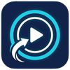

<p align="center">
  
</p>

<h1 align="center">CarpeCast</h1>

<p align="center">
  <a href="README.md">English</a> | <a href="README.zh-CN.md">简体中文</a>
</p>

CarpeCast 是一个在局域网内将 Android 设备的媒体播放状态同步到 Windows 的双端应用。Windows 端显示正在播放的歌曲和进度，并可远程控制 Android 上的播放、暂停、上一首和下一首。

## 下载

- **Windows**: [Microsoft Store](https://apps.microsoft.com/detail/9PNM741WNTGZ)
- **Android**: [Google Play](https://play.google.com/store/apps/details?id=com.jayfunc.carpecast)

## 功能

- 自动发现同一局域网中的 Windows 接收端
- 同步标题、艺术家、专辑、播放状态和进度
- 在 Windows 端控制 Android 媒体会话：播放/暂停、上一首、下一首
- 支持从 Windows 系统媒体传输控制（SMTC）操作播放控制
- Android 端可选择允许同步的媒体应用
- 两端均支持设备名称、端口、主题和语言等设置

## 工作方式

1. Windows 端每两秒通过 UDP 广播自身信息。
2. Android 端发现接收端后，读取已授权媒体应用的媒体会话并发送播放状态。
3. Windows 端接收并展示媒体状态；用户的控制操作再通过 UDP 发回 Android 端。

所有通信仅在本地网络中进行，不依赖云服务。

## 使用

1. 将 Android 设备和 Windows 电脑连接到同一局域网。
2. 启动 Windows 端 CarpeCast，保持其处于运行状态。
3. 在 Android 端安装并打开 CarpeCast。
4. 按提示前往系统设置，为 CarpeCast 开启**通知访问权限**。
5. 在 Android 应用的“设备”页面选择发现的电脑；开始播放媒体后，Windows 端即可显示状态并控制播放。

若设备未被发现，请确认两端的发现端口一致，并允许 Windows 防火墙放行 CarpeCast 的专用网络通信。

## 默认端口

| 用途 | 默认端口 | 说明 |
| --- | ---: | --- |
| 设备发现 | UDP 5001 | Windows 广播、Android 监听 |
| 媒体状态 | UDP 5000 | Android 向 Windows 发送播放状态 |
| 播放控制 | 动态分配 | Windows 向 Android 发送控制命令（端口动态分配） |

Windows 端的“发现端口”和“媒体数据端口”可在设置中修改；Android 端的发现端口也可在设置中修改。为确保设备正常发现，请让两端的发现端口保持一致。

## 开发与构建

### Android

**要求：** Android Studio（或 Gradle 8.7）、JDK 17，以及 Android SDK 35。应用最低支持 Android 8.0（API 26）。

在 Android Studio 中打开 `Android` 目录后即可运行或构建。命令行构建：

```powershell
cd Android
gradle assembleDebug
```

调试 APK 位于 `Android\app\build\outputs\apk\debug\app-debug.apk`。

### Windows

**要求：** Windows 10 1809 或更高版本、.NET 10 SDK，以及安装了 Windows App SDK 工作负载的 Visual Studio 2022。

使用 Visual Studio 打开 `Windows\CarpeCast.slnx` 并运行；或使用命令行：

```powershell
dotnet build Windows\CarpeCast.csproj
dotnet run --project Windows\CarpeCast.csproj
```

## 项目结构

```text
Android/    Android 发送端，负责发现设备、读取媒体会话并执行远程命令
Windows/    WinUI 3 接收端，负责显示媒体状态并发送播放控制命令
```

## 注意事项

- Android 端必须授予通知访问权限，否则无法读取其他应用的媒体会话。
- 部分媒体应用可能不提供完整的标题、封面或播放控制能力。
- 避免与其他应用占用相同的 UDP 端口；修改端口后需同步更新另一端设置。

## 许可证

CarpeCast 采用 [GNU General Public License v3.0](LICENSE) 许可证。
